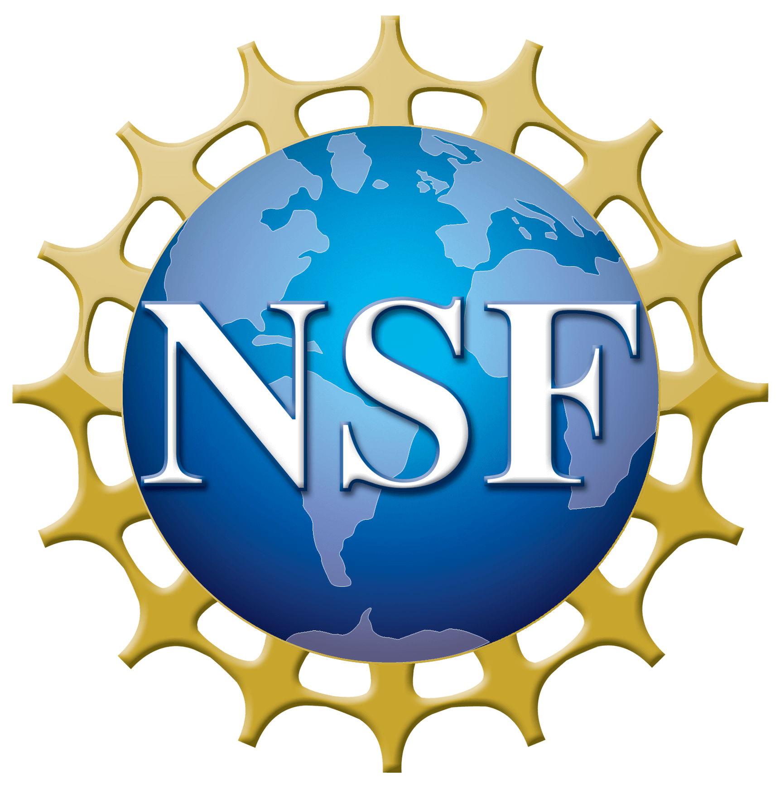

## Photometric Redshifts from SDSS Images with an Interpretable Deep Capsule Network
by Biprateep Dey, Brett H. Andrews, Jeffrey A. Newman, Yao-Yuan Mao, Markus Michael Rau, and Rongpu Zhou.   
### Abstract   
Studies of cosmology, galaxy evolution, and astronomical transients with current and next-generation wide-field imaging surveys (like LSST) are all critically dependent on estimates of galaxy redshifts from imaging data alone. Capsule networks are a new type of neural network architecture that is better suited for identifying morphological features of the input images than traditional convolutional neural networks. We use a deep capsule network trained on the *ugriz* images, spectroscopic redshifts, and Galaxy Zoo spiral/elliptical classifications of ~400,000 SDSS galaxies to do photometric redshift estimation.  We achieve a photometric redshift prediction accuracy and a fraction of catastrophic outliers that are comparable to or better than current state-of-the-art methods while requiring less data and fewer trainable parameters. Furthermore, the decision-making of our capsule network is much more easily interpretable as capsules act as a low-dimensional encoding of the image. When the capsules are projected on a 2-Dimensional manifold, they form a single redshift sequence with the fraction of spirals in a region exhibiting a gradient roughly perpendicular to the redshift sequence. We perturb encodings of real galaxy images in this low-dimensional space to create synthetic galaxy images that demonstrate the image properties (e.g., size, orientation, and surface brightness) encoded by each dimension. We also show how strongly galaxy properties (e.g., magnitudes, colours, and stellar mass) are correlated with each capsule dimension. Finally, we publicly release the code for our capsule network, our estimated redshifts, and additional catalogues.

### Interactive visualizations
- [2D Density preserving UMAP with SDSS images](https://biprateep.de/encapZulate-1/viz/explore_UMAP_DenseMAP.html) (linked in the paper)
- [Video of synthetic galaxy images generated by perturbing capsule dimensions.](https://biprateep.de/encapZulate-1/viz/tinker_vid.mp4)
- [3D Density Preserving UMAP colored by morphology](https://biprateep.de/encapZulate-1/viz/UMAP_3D_morpho_dens.html)
- [3D Density Preserving UMAP colored by spectroscopic redshifts](https://biprateep.de/encapZulate-1/viz/UMAP_3D_spec_z_dens.html)
- [3D UMAP colored by morphology](https://biprateep.de/encapZulate-1/viz/UMAP_3D_morpho.html)
- [3D UMAP colored by spectroscopic redshift](https://biprateep.de/encapZulate-1/viz/UMAP_3D_spec_z.html)
- [3D UMAP colored by photometric redshift](https://biprateep.de/encapZulate-1/viz/UMAP_3D_photo_z.html)
- [2D UMAP colored by spectroscopic redshift showing SDSS images](https://biprateep.de/encapZulate-1/viz/explore_UMAP.html)
- [2D UMAP colored by spectroscopic redshift showing Legacy Survey images](https://biprateep.de/encapZulate-1/viz/explore_UMAP_LS.html)

### Support or Contact

Have questions, comments or new ideas? Feel free to contact: <biprateep@pitt.edu>

### Funding Acknowledgement

This work was supported by the National Science Foundation under Grant No. **AST-2009251**. Any opinions, findings, and conclusions or recommendations expressed in this material are those of the author(s) and do not necessarily reflect the views of the National Science Foundation.
